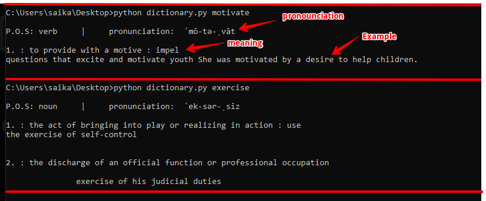

# Dictionary
This is a terminal based dictionary which displays the meaning of the word entered by the user. It scrapes the desired data from web and displays the useful and required information to the user. Here, the useful information is the meaning of the word diplayed by the user.

## Dependencies
- requests
- bs4

**Make sure all dependencies are met**

From terminal run the script with a word as a argument

`dictionary.py <word>`

